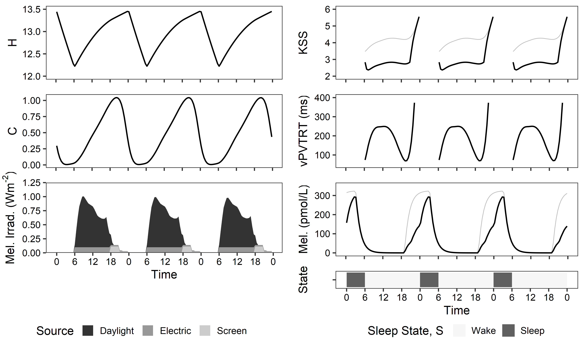

# NIF_Photobiology
A collection of Python files / libraries to implement the Postnova, Abeysuriya, Tekieh, et al. models of human photobiology from measured spectrophotometer data / CIE S 026 metrics / or multi-spectral simulations using [ALFA](https://www.solemma.com/alfa). These models are based on the following papers:

- Postnova, S., Lockley, S. W., & Robinson, P. A. (2018). [Prediction of cognitive performance and subjective sleepiness using a model of arousal dynamics.](https://journals.sagepub.com/doi/pdf/10.1177/0748730418758454) Journal of biological rhythms, 33(2), 203-218.
- Abeysuriya, R. G., Lockley, S. W., Robinson, P. A., & Postnova, S. (2018). [A unified model of melatonin, 6-sulfatoxymelatonin, and sleep dynamics.](https://onlinelibrary.wiley.com/doi/pdf/10.1111/jpi.12474?casa_token=U685fxbY2kAAAAAA:-Es1sPkZynuPUxp24YiBm6JBX5xAlZern9nAaehjYV0VVoLoD0VkfhhtOuYNKDECJcoOSZ_Az1tJ87Y) Journal of Pineal Research, 64(4), e12474.
- Tekieh, T., Lockley, S. W., Robinson, P. A., McCloskey, S., Zobaer, M. S., & Postnova, S. (2020). [Modeling melanopsin-mediated effects of light on circadian phase, melatonin suppression, and subjective sleepiness.](https://onlinelibrary.wiley.com/doi/pdf/10.1111/jpi.12681?casa_token=HUv_r9yK0cgAAAAA:GBWTccDh4mqib35nKi49O26mHjTcWpXyMJyZ7N8CvwXPeuVnarwDZeRN5epJzKeipuY5TV0sT4IQ2yI) Journal of pineal research, 69(3), e12681.

## Terms of use
The code is licensed under GPL v3. For use of the code in research, kindly cite our associated publications from Building Simulation 2021:

- Jakubiec, J. A., & Alight, A. (2021). [Spectral and biological simulation methods for the design of healthy circadian lighting](http://www.jakubiec.net/papers/Jakubiec%20and%20Alight%20-%20NIF%20Lighting%20Metrics%20(Final).pdf). In Proceedings of Building Simulation 2021: Bruges.
- Alight, A., & Jakubiec, J. A. (2021). [Evaluating the use of photobiology-driven alertness and health measures for circadian lighting design](http://jakubiec.net/papers/Alight%20and%20Jakubiec%20-%20Comparison%20of%20photobiological%20measures%20(Final).pdf). In Proceedings of Building Simulation 2021: Bruges.
	
	
## Features
- `biological_model.py` and `example - `files: Calculate the Postnova, Abeysuriya, and Tekieh, et al. models of photobiological dynamics based on sleep/wake dynamics and received light. Outputs include: subjective sleepiness (KSS), melatonin blood level concentration, reaction time (vPVTRT), and phase shifting.
- `spectral_conversion.py` and `example - `files: Convert ALFA spectral irradiance simulations to CIE S 026 outputs automatically.
- `example - getting started.py`: Perform simple photobiological modeling on a short timescale.
- `example - annual lightsolve simulation run.py` and `example - process annual results.py`: Perform annual photobiological modelling and analyze results seasonally.

## Contents
All code is provided in the root folder.
- `*.py` files identified above include libraries and example use cases.
- `*.csv` files contain important response curve data for CIE S 026 (`action_spectra.csv`, `D65.csv`), EML (`c-lambda_lucas2014`), and photopic illuminance (`v_lambda_1924.csv`). 
- The two `example - `folders contain ALFA-simulated results used in the examples. 

## Dependencies
- Python `>= 2.7`
- Numpy
- Python 'Statistics' library

## How to use
1. Download the code using `git clone https://github.com/C38C/NIF_Photobiology.git` or [directly from Github](https://github.com/C38C/NIF_Photobiology/archive/refs/heads/master.zip).
2. Explore the example files.

